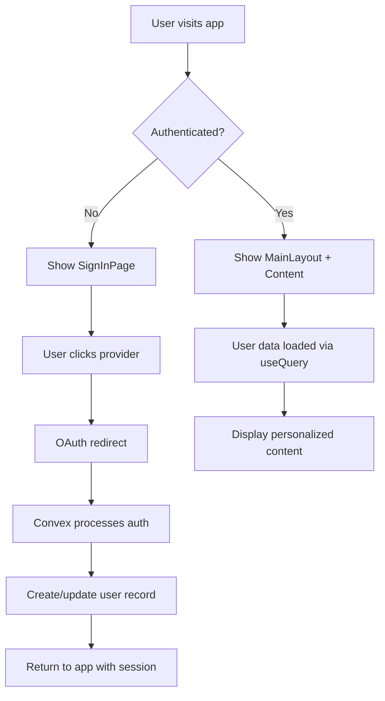

# Authentication System Overview

The Pulse application uses **Convex Auth** for secure, scalable authentication with multiple providers. This system provides user management, session handling, and route protection across the entire application.

## ✅ Current Implementation Status

- ✅ **Convex Auth Integration**: Fully configured and working
- ✅ **Password Authentication**: Email/password login ready to use
- ✅ **OAuth Providers**: Google and GitHub configured (requires credentials)
- ✅ **Frontend Components**: Sign-in page and authentication flows
- ✅ **Route Protection**: Automatic authentication guards
- ✅ **User Management**: Profile storage and session handling

## Authentication Providers

### 🔑 Password Authentication
- **Status**: ✅ Ready to use
- **Features**: Email/password registration and login
- **Setup**: No additional configuration required

### 🔵 Google OAuth
- **Status**: ⚙️ Configured (requires credentials)
- **Features**: One-click Google sign-in
- **Setup**: Requires Google Cloud Console configuration

### ⚫ GitHub OAuth
- **Status**: ⚙️ Configured (requires credentials)
- **Features**: One-click GitHub sign-in
- **Setup**: Requires GitHub Developer Settings configuration

## Key Features

- **Multiple Auth Methods**: Password, Google OAuth, and GitHub OAuth
- **Beautiful Sign-In Page**: Modern UI with Flowbite React components
- **Automatic User Creation**: Users are created/updated on first login
- **Secure Session Management**: JWT-based sessions with automatic handling
- **Route Protection**: Uses Convex's Authenticated/Unauthenticated components
- **Real-time Database**: User data syncs automatically with Convex
- **Type Safety**: Full TypeScript support with proper types
- **Responsive Design**: Works perfectly on mobile and desktop
- **Production Ready**: Comprehensive error handling and deployment guides

## Architecture



## Implementation Details

### Frontend Architecture

The application uses Convex's built-in authentication components:

```typescript
// Root component structure
<ConvexAuthProvider client={convex}>
  <Authenticated>
    <MainLayout>
      <Outlet />
    </MainLayout>
  </Authenticated>
  <Unauthenticated>
    <SignInPage />
  </Unauthenticated>
</ConvexAuthProvider>
```

### Backend Configuration

```typescript
// packages/backend/convex/auth.ts
export const { auth, signIn, signOut, store, isAuthenticated } = convexAuth({
  providers: [
    Password,  // Email/password authentication
    GitHub,    // GitHub OAuth
    Google,    // Google OAuth
  ],
  callbacks: {
    async createOrUpdateUser(ctx, args) {
      // Handles user creation and profile updates
    },
  },
});
```

## Core Components

### Backend (Convex)
- **Auth Configuration**: OAuth provider setup
- **User Schema**: Database tables for user data
- **User Functions**: CRUD operations for user management
- **Security**: Row-level security and authorization

### Frontend (React)
- **Auth Context**: Global state management for authentication
- **Auth Provider**: Wraps the app with auth context
- **Protected Routes**: Route-level authentication guards
- **Main Layout**: Displays user info and logout functionality

## Security Features

- **Never logs secrets**: Tokens and keys are never exposed in logs
- **Row-level security**: Users can only access their own data
- **Secure sessions**: JWT tokens with proper expiration
- **Environment variables**: All secrets stored securely

## Next Steps

1. [Setup & Configuration](/auth/setup) - Configure OAuth providers
2. [Usage Guide](/auth/usage) - How to use the auth system
3. [Security](/auth/security) - Security considerations and best practices