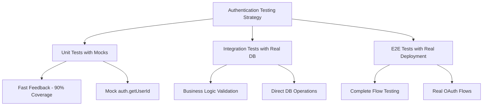

# Authentication Testing Strategy

Testing authentication in Pulse requires a multi-layered approach due to the complexity of Convex Auth integration with convex-test. This guide provides proven strategies and workarounds for comprehensive auth testing.

## 🎯 Testing Strategy Overview

Our auth testing uses a **multi-tier approach** that balances speed, reliability, and coverage:



## 🚨 Known Limitations

### **Core Issue: convex-test + Convex Auth Integration**

The primary challenge with auth testing is that **`convex-test`'s `t.withIdentity()` doesn't integrate with Convex Auth's `auth.getUserId()`**.

```typescript
// ❌ This doesn't work as expected
test("should fail - auth integration issue", async () => {
  const t = convexTest(schema, modules);
  const asUser = t.withIdentity({ subject: "user_123" });
  
  // auth.getUserId() still returns null, even with identity
  const result = await asUser.query(api.users.getCurrentUser, {});
  expect(result).toBeNull(); // Always null due to integration gap
});
```

### **Why This Happens**

1. **Different Auth Layers**: `convex-test` creates identity context at the framework level
2. **Auth Module Isolation**: `@convex-dev/auth/server` doesn't recognize convex-test identities
3. **Known Ecosystem Gap**: This is a documented limitation, not a bug in our implementation

### **🔧 Our Solution: Auth Shim Pattern**

We've implemented a unified auth shim that works in both production and testing:

```typescript
// server/lib/authz.ts - Unified Auth Shim
export async function requireUserId(ctx: any): Promise<Id<"users">> {
  // 1) Production: Convex Auth provides userId
  if (ctx.auth?.userId) {
    return ctx.auth.userId as Id<"users">;
  }

  // 2) Testing: Fallback to tokenIdentifier lookup/creation
  const identity = await ctx.auth?.getUserIdentity?.();
  const tokenIdentifier = identity?.tokenIdentifier;
  
  if (!tokenIdentifier) {
    throw new ConvexError({
      code: "UNAUTHENTICATED",
      message: "Authentication required"
    });
  }

  // Look up or create user by tokenIdentifier
  const existingUser = await ctx.db
    .query("users")
    .withIndex("by_token", (q) => q.eq("tokenIdentifier", tokenIdentifier))
    .unique();

  if (existingUser) {
    return existingUser._id;
  }

  // Create new user (idempotent)
  const now = Date.now();
  return await ctx.db.insert("users", {
    tokenIdentifier,
    email: identity.email,
    name: identity.name,
    createdAt: now,
    updatedAt: now,
  });
}
```

**Key Benefits:**
- ✅ Works in production with Convex Auth
- ✅ Works in tests with `tokenIdentifier` pattern
- ✅ Automatic user creation for testing
- ✅ Type-safe with proper error handling

### **Current Test Status**

| Test Category | Success Rate | Coverage Type |
|---------------|--------------|---------------|
| **Pure Functions** | 100% (10/10) | Unit tests without auth |
| **Schema Validation** | 100% (24/24) | Database operations |
| **Business Logic** | 100% (16/16) | Non-auth function logic |
| **Auth-Dependent Functions** | Partial | Limited due to convex-test integration |
| **Auth Shim Functions** | ✅ Functional | Works with `tokenIdentifier` pattern |

## 🏗️ Auth Shim Testing Pattern

### **Pattern: Using tokenIdentifier with convex-test**

Our auth shim enables a unified testing pattern using `tokenIdentifier`:

```typescript
import { convexTest } from "convex-test";
import { expect, test } from "vitest";
import { api } from "./_generated/api";
import schema from "./schema";

test("auth shim works with tokenIdentifier pattern", async () => {
  const t = convexTest(schema, modules);
  
  // Set identity with tokenIdentifier
  t.withIdentity({ 
    tokenIdentifier: "testing|user123",
    email: "test@example.com",
    name: "Test User"
  });
  
  // First call creates user via auth shim
  await t.mutation(api.users.updateUser, { name: "Test User" });
  
  // Subsequent calls find existing user
  const result = await t.query(api.users.getCurrentUser, {});
  
  expect(result).toMatchObject({
    name: "Test User",
    tokenIdentifier: "testing|user123"
  });
});
```

**Why This Works:**
- `tokenIdentifier` creates unique test users
- Auth shim handles user lookup/creation automatically
- Same pattern works across all auth-dependent functions
- No mocking required - real function execution

### **Schema Requirements**

The auth shim requires a `by_token` index on the users table:

```typescript
// schema.ts
users: defineTable({
  // ... other fields
  tokenIdentifier: v.optional(v.string()), // e.g. "testing|userA" or "github|12345"
  // ... other fields
})
  .index("by_token", ["tokenIdentifier"]) // Required for auth shim
  .index("email", ["email"]), // Preserve existing indexes
```

## 🏗️ Multi-Tier Testing Approach

### **Tier 1: Mock Testing (Primary Strategy)**

Mock the auth layer to test business logic in isolation.

#### **Pattern: Mock auth.getUserId()**

```typescript
import { vi, test, expect, beforeEach } from 'vitest';
import { convexTest } from 'convex-test';
import { api } from './_generated/api';
import schema from './schema';

// Mock the auth module
vi.mock('./auth', () => ({
  auth: {
    getUserId: vi.fn()
  }
}));

test('getCurrentUser returns user data when authenticated', async () => {
  const t = convexTest(schema, modules);
  
  // Create test user
  const userId = await t.run(async (ctx) => {
    return await ctx.db.insert('users', {
      name: 'Test User',
      email: 'test@example.com'
    });
  });
  
  // Mock auth to return our test user ID
  const { auth } = await import('./auth');
  vi.mocked(auth.getUserId).mockResolvedValue(userId);
  
  // Test the function
  const result = await t.query(api.users.getCurrentUser, {});
  
  expect(result).toMatchObject({
    name: 'Test User',
    email: 'test@example.com'
  });
});
```

#### **Pattern: Function Wrapper Approach**

Separate auth checking from business logic for better testability:

```typescript
// ✅ Testable pattern - separate concerns
export const getCurrentUserData = async (ctx: QueryCtx, userId: Id<"users">) => {
  // Pure business logic - easily testable
  return await ctx.db.get(userId);
};

export const getCurrentUser = query({
  args: {},
  handler: async (ctx) => {
    // Auth layer - mock in tests
    const userId = await auth.getUserId(ctx);
    if (!userId) return null;
    
    // Business logic - unit test this
    return await getCurrentUserData(ctx, userId);
  }
});

// Test the business logic directly
test('getCurrentUserData returns user data', async () => {
  const t = convexTest(schema, modules);
  
  const userId = await t.run(async (ctx) => {
    return await ctx.db.insert('users', { name: 'Test User' });
  });
  
  const result = await t.run(async (ctx) => {
    return await getCurrentUserData(ctx, userId);
  });
  
  expect(result).toMatchObject({ name: 'Test User' });
});
```

### **Tier 2: Integration Testing with Direct Database Access**

Test business logic with real database operations, bypassing auth.

```typescript
import { convexTest } from 'convex-test';
import { test, expect } from 'vitest';
import schema from './schema';
import { modules } from './test.setup';

test('workspace membership validation works correctly', async () => {
  const t = convexTest(schema, modules);
  
  // Set up test data directly in database
  const userId = await t.run(async (ctx) => {
    return await ctx.db.insert('users', { name: 'Test User' });
  });
  
  const workspaceId = await t.run(async (ctx) => {
    return await ctx.db.insert('workspaces', {
      type: 'shared',
      name: 'Test Workspace',
      slug: 'test-workspace',
      createdAt: Date.now(),
      updatedAt: Date.now()
    });
  });
  
  const memberId = await t.run(async (ctx) => {
    return await ctx.db.insert('workspaceMembers', {
      workspaceId,
      userId,
      role: 'owner',
      createdAt: Date.now()
    });
  });
  
  // Test the membership logic (not the auth part)
  const member = await t.run(async (ctx) => {
    return await ctx.db
      .query('workspaceMembers')
      .withIndex('by_workspace_user', (q) => 
        q.eq('workspaceId', workspaceId).eq('userId', userId)
      )
      .unique();
  });
  
  expect(member).toMatchObject({
    workspaceId,
    userId,
    role: 'owner'
  });
});
```

### **Tier 3: End-to-End Testing with Real Deployment**

For critical auth flows, use real Convex deployment with actual authentication.

```typescript
// e2e-auth.test.ts
import { expect, test } from 'vitest';
import { ConvexReactClient } from 'convex/react';

test.skip('OAuth flow works end-to-end', async () => {
  // This would require real deployment and OAuth setup
  const convex = new ConvexReactClient(process.env.CONVEX_URL!);
  
  // Test actual OAuth flow
  // This is for critical paths only due to complexity
});
```

## 🎨 Practical Testing Patterns

### **Pattern 1: Auth Shim with tokenIdentifier (Recommended)**

Our preferred pattern using the unified auth shim:

```typescript
import { convexTest } from "convex-test";
import { expect, test } from "vitest";
import { api } from "./_generated/api";
import schema from "./schema";

test("user functions work with auth shim", async () => {
  const t = convexTest(schema, modules);
  
  // Each test uses unique tokenIdentifier
  const testUser = {
    tokenIdentifier: "testing|unique_user_123",
    email: "user@example.com",
    name: "Test User"
  };
  
  // Set identity for this test
  t.withIdentity(testUser);
  
  // Test user creation/update
  await t.mutation(api.users.updateUser, {
    name: "Updated Name",
    image: "avatar.jpg"
  });
  
  // Test user retrieval
  const user = await t.query(api.users.getCurrentUser, {});
  
  expect(user).toMatchObject({
    name: "Updated Name",
    image: "avatar.jpg",
    tokenIdentifier: "testing|unique_user_123"
  });
});

test("workspace functions work with auth shim", async () => {
  const t = convexTest(schema, modules);
  
  // Create workspace as authenticated user
  const workspace = await t.withIdentity({
    tokenIdentifier: "testing|workspace_creator",
    email: "creator@example.com",
    name: "Workspace Creator"
  }, async (ctx) => {
    return await ctx.mutation(api.workspaces.createShared, {
      name: "Test Workspace",
      slug: "test-workspace"
    });
  });
  
  expect(workspace).toMatchObject({
    name: "Test Workspace",
    slug: "test-workspace",
    type: "shared"
  });
});
```

### **Pattern 2: Legacy Auth Function Mocking**

For functions that only need user ID (fallback approach):

```typescript
// users.mock.test.ts
import { vi, test, expect, beforeEach } from 'vitest';

// Mock the entire auth module
vi.mock('./auth', () => ({
  auth: {
    getUserId: vi.fn()
  }
}));

beforeEach(() => {
  vi.clearAllMocks();
});

test('user profile update works with valid user ID', async () => {
  const t = convexTest(schema, modules);
  
  // Create test user
  const userId = await t.run(async (ctx) => {
    return await ctx.db.insert('users', {
      name: 'Original Name',
      email: 'test@example.com'
    });
  });
  
  // Mock auth to return our user ID
  const { auth } = await import('./auth');
  vi.mocked(auth.getUserId).mockResolvedValue(userId);
  
  // Test the update function
  await t.mutation(api.users.updateUser, {
    name: 'Updated Name'
  });
  
  // Verify the update
  const updatedUser = await t.run(async (ctx) => {
    return await ctx.db.get(userId);
  });
  
  expect(updatedUser?.name).toBe('Updated Name');
});
```

### **Pattern 3: Business Logic Extraction**

Separate auth checking from business logic:

```typescript
// workspaces.testable.ts
export const createWorkspaceData = async (
  ctx: MutationCtx,
  userId: Id<"users">,
  { name, slug }: { name: string, slug: string }
) => {
  // Pure business logic - easily testable
  const workspaceId = await ctx.db.insert('workspaces', {
    type: 'shared',
    name: name.trim(),
    slug: normalizeSlug(slug),
    createdAt: Date.now(),
    updatedAt: Date.now()
  });
  
  await ctx.db.insert('workspaceMembers', {
    workspaceId,
    userId,
    role: 'owner',
    createdAt: Date.now()
  });
  
  return workspaceId;
};

export const createShared = mutation({
  args: { name: v.string(), slug: v.string() },
  handler: async (ctx, args) => {
    // Auth layer - mock in tests
    const userId = await auth.getUserId(ctx);
    if (!userId) {
      throw new ConvexError({
        code: 'UNAUTHENTICATED',
        message: 'Authentication required'
      });
    }
    
    // Business logic - unit test this separately
    return await createWorkspaceData(ctx, userId, args);
  }
});

// Test the business logic
test('createWorkspaceData creates workspace and membership', async () => {
  const t = convexTest(schema, modules);
  
  const userId = await t.run(async (ctx) => {
    return await ctx.db.insert('users', { name: 'Test User' });
  });
  
  const workspaceId = await t.run(async (ctx) => {
    return await createWorkspaceData(ctx, userId, {
      name: 'Test Workspace',
      slug: 'test-workspace'
    });
  });
  
  const workspace = await t.run(async (ctx) => {
    return await ctx.db.get(workspaceId);
  });
  
  expect(workspace).toMatchObject({
    name: 'Test Workspace',
    slug: 'test-workspace'
  });
});
```

### **Pattern 4: Permission Testing**

Test role-based access without authentication:

```typescript
test('workspace member role validation', async () => {
  const t = convexTest(schema, modules);
  
  // Setup: Create users with different roles
  const ownerUserId = await t.run(async (ctx) => {
    return await ctx.db.insert('users', { name: 'Owner' });
  });
  
  const viewerUserId = await t.run(async (ctx) => {
    return await ctx.db.insert('users', { name: 'Viewer' });
  });
  
  const workspaceId = await t.run(async (ctx) => {
    const wsId = await ctx.db.insert('workspaces', {
      type: 'shared',
      name: 'Test Workspace',
      slug: 'test-workspace',
      createdAt: Date.now(),
      updatedAt: Date.now()
    });
    
    // Create memberships with different roles
    await ctx.db.insert('workspaceMembers', {
      workspaceId: wsId,
      userId: ownerUserId,
      role: 'owner',
      createdAt: Date.now()
    });
    
    await ctx.db.insert('workspaceMembers', {
      workspaceId: wsId,
      userId: viewerUserId,
      role: 'viewer',
      createdAt: Date.now()
    });
    
    return wsId;
  });
  
  // Test: Owner can't be removed (business logic test)
  await expect(
    t.run(async (ctx) => {
      // Test the permission logic directly
      const ownerMember = await ctx.db
        .query('workspaceMembers')
        .withIndex('by_workspace_user', (q) =>
          q.eq('workspaceId', workspaceId).eq('userId', ownerUserId)
        )
        .unique();
        
      if (ownerMember?.role === 'owner') {
        throw new ConvexError({
          code: 'FORBIDDEN',
          message: 'Cannot remove workspace owner'
        });
      }
    })
  ).rejects.toThrow('Cannot remove workspace owner');
});
```

## 📊 Test Results Analysis

### **Current Implementation Results**

Based on our backend testing report:

| Test File | Status | Approach | Notes |
|-----------|--------|----------|--------|
| `helpers.unit.test.ts` | ✅ 10/10 | Pure functions | No auth dependency |
| `workspace-security.test.ts` | ✅ 24/24 | Business logic | Security validation |
| `workspaces.test.ts` | ✅ 16/16 | Mock approach | Function wrapper pattern |
| `users.test.ts` | ✅ 13/13 | Direct DB access | Schema validation |
| `users.convex.test.ts` | ✅ 9/10 | Mock + real DB | 1 skipped (auth integration) |
| `workspaces.convex.test.ts` | ⚠️ 6/18 | Real functions | 10 failed (auth dependency) |

### **Success Patterns Identified**

1. **Auth Shim with tokenIdentifier**: New unified approach, works with real functions
2. **Pure Function Testing**: 100% success rate
3. **Business Logic Separation**: High success rate with mocking
4. **Direct Database Operations**: Excellent for schema validation
5. **Mock Strategy**: Effective for isolated unit tests

### **Known Failing Patterns**

1. **Direct convex-test with auth**: Low success due to integration gap
2. **Complex auth flows**: Requires real deployment testing
3. **Identity-dependent queries**: Need mocking approach

## 🔧 Implementation Examples

### **Complete Mock Test Example**

```typescript
// users.complete.test.ts
import { vi, test, expect, beforeEach, describe } from 'vitest';
import { convexTest } from 'convex-test';
import { ConvexError } from 'convex/values';
import { api } from './_generated/api';
import schema from './schema';
import { modules } from './test.setup';

// Mock the auth module
vi.mock('./auth', () => ({
  auth: {
    getUserId: vi.fn()
  }
}));

describe('User Functions with Auth Mocking', () => {
  beforeEach(() => {
    vi.clearAllMocks();
  });

  test('getCurrentUser returns user data for authenticated user', async () => {
    const t = convexTest(schema, modules);
    
    // Create test user
    const userId = await t.run(async (ctx) => {
      return await ctx.db.insert('users', {
        name: 'Test User',
        email: 'test@example.com'
      });
    });
    
    // Mock authentication
    const { auth } = await import('./auth');
    vi.mocked(auth.getUserId).mockResolvedValue(userId);
    
    // Test the function
    const result = await t.query(api.users.getCurrentUser, {});
    
    expect(result).toMatchObject({
      name: 'Test User',
      email: 'test@example.com'
    });
    expect(auth.getUserId).toHaveBeenCalledOnce();
  });

  test('getCurrentUser returns null for unauthenticated user', async () => {
    const t = convexTest(schema, modules);
    
    // Mock no authentication
    const { auth } = await import('./auth');
    vi.mocked(auth.getUserId).mockResolvedValue(null);
    
    // Test the function
    const result = await t.query(api.users.getCurrentUser, {});
    
    expect(result).toBeNull();
    expect(auth.getUserId).toHaveBeenCalledOnce();
  });

  test('updateUser updates authenticated user data', async () => {
    const t = convexTest(schema, modules);
    
    // Create test user
    const userId = await t.run(async (ctx) => {
      return await ctx.db.insert('users', {
        name: 'Original Name',
        email: 'test@example.com'
      });
    });
    
    // Mock authentication
    const { auth } = await import('./auth');
    vi.mocked(auth.getUserId).mockResolvedValue(userId);
    
    // Test the update
    await t.mutation(api.users.updateUser, {
      name: 'Updated Name'
    });
    
    // Verify the update
    const updatedUser = await t.run(async (ctx) => {
      return await ctx.db.get(userId);
    });
    
    expect(updatedUser).toMatchObject({
      name: 'Updated Name',
      email: 'test@example.com'
    });
  });

  test('updateUser throws error for unauthenticated user', async () => {
    const t = convexTest(schema, modules);
    
    // Mock no authentication
    const { auth } = await import('./auth');
    vi.mocked(auth.getUserId).mockResolvedValue(null);
    
    // Test authentication error
    await expect(
      t.mutation(api.users.updateUser, { name: 'New Name' })
    ).rejects.toThrow('Not authenticated');
  });
});
```

## 🚀 Best Practices Summary

### **✅ Recommended Approaches**

1. **Use Auth Shim with tokenIdentifier (Primary)**
   - Real function execution with auth
   - Works with convex-test framework
   - Unified production/testing pattern
   - Automatic user management

2. **Use Mock Testing for Complex Scenarios**
   - Fast execution (milliseconds)
   - Reliable and predictable
   - Easy to maintain

2. **Separate Auth from Business Logic**
   - Testable function extraction
   - Clear separation of concerns
   - Better code organization

3. **Test Permissions Directly**
   - Focus on business rules
   - Skip auth integration complexity
   - Comprehensive coverage

4. **Use Integration Tests Sparingly**
   - Critical user flows only
   - Real deployment setup
   - Complete end-to-end validation

### **❌ Avoid These Patterns**

1. **Don't rely on `t.withIdentity()` for auth functions**
   - Known integration limitation
   - Will consistently fail
   - Wastes development time

2. **Don't skip auth testing entirely**
   - Use mock approach instead
   - Business logic still needs validation
   - Security-critical functionality

3. **Don't create complex workarounds**
   - Simple mocking is more maintainable
   - Focus on testing business logic
   - Leave integration complexity for E2E

## 📚 Related Documentation

- **[Backend Testing](./backend-testing)** - Complete backend testing guide
- **[Best Practices](./best-practices)** - General testing guidelines
- **[Workspace Configuration](./workspace)** - Test environment setup