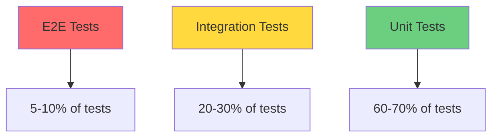

# Testing Best Practices

This guide outlines proven testing patterns, conventions, and strategies that ensure maintainable, reliable, and efficient tests across the Pulse application.

## 🎯 Testing Philosophy

### **Core Principles**

1. **Fast Feedback Loops**: Tests should run quickly to enable rapid development
2. **Empirical Validation**: Evidence-based testing with measurable outcomes
3. **Test-Driven Development**: Write tests first, implementation second
4. **Maintainable Code**: Tests should be as clean and maintainable as production code

### **Testing Pyramid**



**Distribution Guidelines**:
- **Unit Tests**: 60-70% - Fast, isolated, comprehensive coverage
- **Integration Tests**: 20-30% - Component interaction validation
- **E2E Tests**: 5-10% - Critical user journey validation

## 📋 Test Structure & Organization

### **AAA Pattern (Arrange, Act, Assert)**

Every test should follow this clear structure:

```typescript
test('user can update their profile', async () => {
  // 🏗️ Arrange - Set up test data and mocks
  const userId = await createTestUser({ name: 'John Doe' });
  mockAuthUser(userId);
  
  // ⚡ Act - Execute the function under test
  await t.mutation(api.users.updateUser, { name: 'Jane Doe' });
  
  // ✅ Assert - Verify expected outcomes
  const updatedUser = await getUser(userId);
  expect(updatedUser.name).toBe('Jane Doe');
});
```

### **File Naming Conventions**

```
src/
├── components/
│   ├── Dashboard.tsx
│   └── __tests__/
│       ├── Dashboard.test.tsx           # ✅ Component tests
│       ├── Dashboard.integration.test.tsx # ✅ Integration tests
│       └── Dashboard.e2e.test.tsx      # ✅ End-to-end tests
├── lib/
│   ├── utils.ts
│   └── __tests__/
│       └── utils.test.ts               # ✅ Utility tests
└── test/
    ├── setup.ts                        # ✅ Global test setup
    ├── utils.tsx                       # ✅ Test utilities
    └── factories.ts                    # ✅ Test data factories
```

### **Test Organization Patterns**

```typescript
describe('UserService', () => {
  describe('getCurrentUser', () => {
    describe('when user is authenticated', () => {
      test('returns user data', () => {
        // Test implementation
      });
      
      test('includes user preferences', () => {
        // Test implementation
      });
    });
    
    describe('when user is not authenticated', () => {
      test('returns null', () => {
        // Test implementation
      });
      
      test('does not throw error', () => {
        // Test implementation
      });
    });
  });
});
```

## 🎨 Writing Effective Tests

### **Test Naming Best Practices**

**❌ Poor Test Names**:
```typescript
test('it works', () => {});
test('test user creation', () => {});
test('should return true', () => {});
```

**✅ Excellent Test Names**:
```typescript
test('creates user with valid email and password', () => {});
test('throws validation error when email is invalid', () => {});
test('returns null when user is not found', () => {});
```

**Pattern**: `test('should [expected behavior] when [condition]', () => {})`

### **Descriptive Assertions**

```typescript
// ❌ Generic assertions
expect(result).toBeTruthy();
expect(data.length).toBeGreaterThan(0);

// ✅ Specific assertions
expect(user.email).toBe('test@example.com');
expect(workspaces).toHaveLength(3);
expect(response).toMatchObject({
  success: true,
  userId: expect.any(String)
});
```

### **Test Data Management**

#### **Factory Pattern for Test Data**

```typescript
// test/factories.ts
export const createTestUser = (overrides = {}) => ({
  _id: generateId(),
  name: 'Test User',
  email: 'test@example.com',
  createdAt: Date.now(),
  updatedAt: Date.now(),
  ...overrides
});

export const createTestWorkspace = (overrides = {}) => ({
  _id: generateId(),
  name: 'Test Workspace',
  slug: 'test-workspace',
  type: 'shared' as const,
  plan: 'free' as const,
  createdAt: Date.now(),
  updatedAt: Date.now(),
  ...overrides
});

// Usage in tests
test('user can join workspace', async () => {
  const user = createTestUser({ name: 'John Doe' });
  const workspace = createTestWorkspace({ name: 'Development Team' });
  
  // Test implementation
});
```

#### **Test Data Isolation**

```typescript
describe('Workspace Tests', () => {
  let testUser: TestUser;
  let testWorkspace: TestWorkspace;
  
  beforeEach(async () => {
    // Fresh data for each test
    testUser = await createTestUser();
    testWorkspace = await createTestWorkspace();
  });
  
  afterEach(async () => {
    // Clean up test data
    await cleanupTestData();
  });
});
```

## 🔧 Mocking Strategies

### **Mock Hierarchy**

1. **External Services**: Always mock (APIs, databases, file systems)
2. **Internal Modules**: Mock for unit tests, real for integration tests
3. **Pure Functions**: Rarely mock (test directly)

### **Effective Mock Patterns**

#### **Service Layer Mocking**

```typescript
// ✅ Mock at service boundaries
vi.mock('@/services/emailService', () => ({
  sendEmail: vi.fn().mockResolvedValue({ success: true }),
  validateEmail: vi.fn().mockReturnValue(true)
}));

// ✅ Provide mock controls in tests
test('sends welcome email on user registration', async () => {
  const mockSendEmail = vi.mocked(emailService.sendEmail);
  
  await registerUser({ email: 'test@example.com' });
  
  expect(mockSendEmail).toHaveBeenCalledWith({
    to: 'test@example.com',
    template: 'welcome'
  });
});
```

#### **Authentication Mocking**

```typescript
// Mock auth at module level
vi.mock('./auth', () => ({
  auth: {
    getUserId: vi.fn()
  }
}));

// Control auth state per test
beforeEach(() => {
  vi.clearAllMocks();
});

test('authenticated user can access profile', async () => {
  const { auth } = await import('./auth');
  vi.mocked(auth.getUserId).mockResolvedValue('user_123');
  
  const profile = await getUserProfile();
  expect(profile).toBeDefined();
});

test('unauthenticated user gets null profile', async () => {
  const { auth } = await import('./auth');
  vi.mocked(auth.getUserId).mockResolvedValue(null);
  
  const profile = await getUserProfile();
  expect(profile).toBeNull();
});
```

### **Mock Verification Patterns**

```typescript
test('logs user activity correctly', async () => {
  const mockLogger = vi.fn();
  const mockAnalytics = vi.fn();
  
  await performUserAction('click_button', mockLogger, mockAnalytics);
  
  // Verify interactions
  expect(mockLogger).toHaveBeenCalledWith('user_action', {
    action: 'click_button',
    timestamp: expect.any(Number)
  });
  
  expect(mockAnalytics).toHaveBeenCalledWith('track', 'click_button');
});
```

## 🧪 Testing Different Layers

### **Component Testing (Frontend)**

```typescript
import { render, screen, fireEvent } from '@testing-library/react';
import { expect, test, vi } from 'vitest';
import { UserProfile } from '../UserProfile';

test('displays user information correctly', () => {
  const user = createTestUser({ name: 'John Doe' });
  
  render(<UserProfile user={user} />);
  
  expect(screen.getByText('John Doe')).toBeInTheDocument();
  expect(screen.getByText(user.email)).toBeInTheDocument();
});

test('calls onUpdate when save button is clicked', async () => {
  const mockOnUpdate = vi.fn();
  const user = createTestUser();
  
  render(<UserProfile user={user} onUpdate={mockOnUpdate} />);
  
  const nameInput = screen.getByLabelText('Name');
  const saveButton = screen.getByRole('button', { name: /save/i });
  
  fireEvent.change(nameInput, { target: { value: 'New Name' } });
  fireEvent.click(saveButton);
  
  expect(mockOnUpdate).toHaveBeenCalledWith({
    ...user,
    name: 'New Name'
  });
});
```

### **Function Testing (Backend)**

```typescript
import { convexTest } from 'convex-test';
import { expect, test } from 'vitest';
import { api } from './_generated/api';
import schema from './schema';
import { modules } from './test.setup';

test('creates workspace with valid data', async () => {
  const t = convexTest(schema, modules);
  
  // Mock authentication
  mockAuthUser('user_123');
  
  const workspaceData = {
    name: 'Test Workspace',
    slug: 'test-workspace'
  };
  
  const workspace = await t.mutation(api.workspaces.createShared, workspaceData);
  
  expect(workspace).toMatchObject({
    name: 'Test Workspace',
    slug: 'test-workspace',
    type: 'shared'
  });
});
```

### **Integration Testing**

```typescript
test('user registration flow creates user and sends email', async () => {
  const t = convexTest(schema, modules);
  
  const userData = {
    email: 'test@example.com',
    password: 'securePassword123'
  };
  
  // Act - perform the full registration flow
  const result = await t.action(api.auth.register, userData);
  
  // Assert - verify user creation
  expect(result.success).toBe(true);
  expect(result.userId).toBeDefined();
  
  // Assert - verify user exists in database
  const user = await t.run(async (ctx) => {
    return await ctx.db.get(result.userId);
  });
  
  expect(user).toMatchObject({
    email: userData.email,
    emailVerified: false
  });
  
  // Assert - verify email was sent
  expect(mockEmailService.sendEmail).toHaveBeenCalledWith({
    to: userData.email,
    template: 'email_verification'
  });
});
```

## 🚀 Performance & Optimization

### **Fast Test Execution**

#### **Parallel Test Execution**

```typescript
// vitest.workspace.ts
export default defineWorkspace([
  {
    test: {
      maxConcurrency: 5,           // Limit concurrent tests
      slowTestThreshold: 300,      // Flag slow tests
      testTimeout: 5000,           // Reasonable timeout
    }
  }
]);
```

#### **Efficient Setup and Teardown**

```typescript
// ✅ Efficient - reuse expensive setup
describe('Database Tests', () => {
  let testDatabase: TestDatabase;
  
  beforeAll(async () => {
    // Expensive setup once per test suite
    testDatabase = await createTestDatabase();
  });
  
  afterAll(async () => {
    // Cleanup once per test suite
    await testDatabase.cleanup();
  });
  
  beforeEach(async () => {
    // Fast cleanup between tests
    await testDatabase.clearData();
  });
});

// ❌ Inefficient - expensive setup per test
beforeEach(async () => {
  testDatabase = await createTestDatabase(); // Too expensive
});
```

### **Selective Test Execution**

```typescript
// Use test.only for focused development
test.only('should focus on this test during development', () => {
  // Test implementation
});

// Use test.skip for temporarily disabled tests
test.skip('should skip this flaky test', () => {
  // Test implementation
});

// Use test.concurrent for independent tests
test.concurrent('can run in parallel with other concurrent tests', async () => {
  // Independent test logic
});
```

## 🔍 Debugging & Troubleshooting

### **Debug Information in Tests**

```typescript
test('complex calculation produces expected result', () => {
  const input = { a: 10, b: 20, c: 30 };
  const result = complexCalculation(input);
  
  // Add debug information for failed tests
  console.log('Input:', input);
  console.log('Result:', result);
  console.log('Expected calculation steps:', {
    step1: input.a + input.b,
    step2: (input.a + input.b) * input.c,
    final: ((input.a + input.b) * input.c) / 2
  });
  
  expect(result).toBe(900);
});
```

### **Snapshot Testing for Complex Objects**

```typescript
test('user profile matches expected structure', () => {
  const userProfile = generateUserProfile(testUser);
  
  // Useful for complex object structures
  expect(userProfile).toMatchSnapshot();
});

// Update snapshots when structure intentionally changes:
// pnpm test --update-snapshots
```

### **Error Testing Patterns**

```typescript
test('throws descriptive error for invalid input', async () => {
  const invalidData = { email: 'not-an-email' };
  
  await expect(
    t.mutation(api.users.create, invalidData)
  ).rejects.toThrow('Invalid email format');
});

test('handles database connection errors gracefully', async () => {
  // Mock database failure
  mockDatabaseError('CONNECTION_FAILED');
  
  const result = await getUserProfile('user_123');
  
  expect(result).toEqual({
    error: 'Database temporarily unavailable',
    retry: true
  });
});
```

## 📊 Coverage & Metrics

### **Coverage Configuration**

```typescript
// vitest.workspace.ts
export default defineWorkspace([
  {
    test: {
      coverage: {
        provider: 'v8',
        reporter: ['text', 'html', 'json'],
        thresholds: {
          global: {
            statements: 85,
            branches: 80,
            functions: 85,
            lines: 85
          }
        },
        exclude: [
          'node_modules/',
          'src/test/',
          '**/*.test.{ts,tsx}',
          '**/*.d.ts',
          'src/types/'
        ]
      }
    }
  }
]);
```

### **Quality Metrics**

```bash
# Generate comprehensive coverage report
pnpm test --coverage

# Run tests with performance metrics
pnpm test --reporter=verbose

# Check for slow tests
pnpm test --reporter=verbose | grep -E '\d+ms' | sort -n
```

### **Coverage Analysis**

```typescript
// Focus on meaningful coverage, not just numbers
test('user service covers all critical paths', () => {
  // ✅ Test happy path
  expect(createUser(validData)).resolves.toBeDefined();
  
  // ✅ Test error conditions
  expect(createUser(invalidData)).rejects.toThrow();
  
  // ✅ Test edge cases
  expect(createUser(edgeCaseData)).resolves.toBeDefined();
  
  // ✅ Test boundary conditions
  expect(createUser(boundaryData)).resolves.toBeDefined();
});
```

## 🛡️ Security Testing

### **Input Validation Testing**

```typescript
describe('Input Security', () => {
  test('rejects SQL injection attempts', async () => {
    const maliciousInput = "'; DROP TABLE users; --";
    
    await expect(
      searchUsers(maliciousInput)
    ).rejects.toThrow('Invalid search query');
  });
  
  test('sanitizes XSS attempts', async () => {
    const xssInput = '<script>alert("xss")</script>';
    
    const result = await updateUserName(xssInput);
    
    expect(result.name).not.toContain('<script>');
    expect(result.name).toBe('alert("xss")'); // Sanitized
  });
  
  test('validates authentication tokens', async () => {
    const invalidToken = 'fake.jwt.token';
    
    await expect(
      getUserFromToken(invalidToken)
    ).rejects.toThrow('Invalid authentication token');
  });
});
```

### **Permission Testing**

```typescript
describe('Authorization', () => {
  test('user can only access own resources', async () => {
    mockAuthUser('user_123');
    
    // Should succeed for own resources
    const ownProfile = await getProfile('user_123');
    expect(ownProfile).toBeDefined();
    
    // Should fail for other users' resources
    await expect(
      getProfile('user_456')
    ).rejects.toThrow('Insufficient permissions');
  });
  
  test('admin can access all resources', async () => {
    mockAuthUser('admin_123', { role: 'admin' });
    
    const anyProfile = await getProfile('user_456');
    expect(anyProfile).toBeDefined();
  });
});
```

## 📚 Continuous Integration

### **CI/CD Test Configuration**

```yaml
# .github/workflows/test.yml
name: Test Suite

on: [push, pull_request]

jobs:
  test:
    runs-on: ubuntu-latest
    steps:
      - uses: actions/checkout@v3
      - uses: actions/setup-node@v3
        with:
          node-version: '18'
          cache: 'pnpm'
      
      - run: pnpm install
      - run: pnpm test --run --coverage
      - run: pnpm test:e2e --run
      
      - name: Upload Coverage
        uses: codecov/codecov-action@v3
        with:
          file: ./coverage/coverage-final.json
```

### **Quality Gates**

```bash
# Pre-commit hooks
pnpm test --run --bail
pnpm lint
pnpm typecheck

# Pull request requirements
pnpm test --coverage --threshold 85
pnpm test:integration --run
```

## 🔗 Related Documentation

- **[Authentication Testing](./auth-testing)** - Specific strategies for testing auth flows
- **[Workspace Configuration](./workspace)** - Test environment setup
- **[Web Testing](./web-testing)** - Frontend-specific testing patterns
- **[Backend Testing](./backend-testing)** - Backend-specific testing patterns