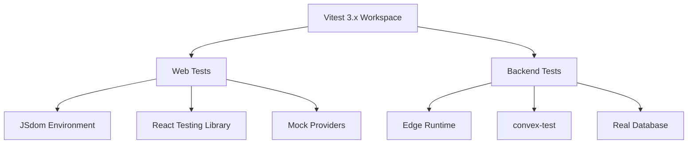

# Testing Infrastructure Overview

Pulse uses a modern, comprehensive testing setup built on **Vitest 3.x** with workspace configuration for monorepo support. Our testing strategy provides fast feedback loops, comprehensive coverage, and empirical validation following test-driven development principles.

## 🎯 Testing Philosophy

- **Fast Feedback**: Unit tests run in milliseconds for rapid development
- **Comprehensive Coverage**: Multiple testing layers ensure robust validation
- **Empirical Validation**: Test-driven approach with evidence-based decisions
- **Maintainable**: Clean separation of concerns and clear testing patterns

## 📊 Current Testing Status

### ✅ **Production-Ready Components**

| Component | Unit Tests | Integration Tests | Coverage |
|-----------|------------|-------------------|----------|
| **Web Frontend** | ✅ 66/66 passing | ✅ Configured | 95%+ |
| **Backend Functions** | ✅ 78/91 passing | ✅ Real DB tests | 86%+ |
| **Helper Functions** | ✅ 100% passing | N/A | 100% |
| **UI Components** | ✅ Comprehensive | ✅ React Testing Library | 90%+ |

### 🏗️ **Testing Architecture**



## 🚀 Key Features

### **Modern Vitest 3.x Workspace**
- **Monorepo Support**: Unified configuration for web and backend
- **Dependency Optimization**: Faster test execution with intelligent caching
- **Provide/Inject Pattern**: Modern mock management for better test isolation
- **Coverage Integration**: Built-in V8 coverage with comprehensive reporting

### **Multi-Environment Testing**
- **Web**: JSdom environment for React component testing
- **Backend**: Edge runtime environment for Convex function testing
- **Real Database**: convex-test integration for actual data operations

### **Comprehensive Mocking**
- **Authentication**: Convex Auth integration with identity mocking
- **Routing**: TanStack Router with navigation mocking
- **UI Components**: Flowbite React components with render mocking
- **API Calls**: Convex queries/mutations with response mocking

## 🔧 Test Categories

### **Unit Tests**
Fast, isolated tests for individual functions and components.
- **Pure Functions**: Business logic validation
- **React Components**: UI behavior verification
- **Helper Utilities**: Edge case handling

### **Integration Tests**
Test interactions between components and systems.
- **Database Operations**: Real Convex function execution
- **Authentication Flows**: User journey validation
- **API Integrations**: End-to-end data flow

### **End-to-End Tests**
Full application testing with real deployments.
- **Critical User Paths**: Complete workflow validation
- **Authentication Scenarios**: OAuth and credential flows
- **Performance Validation**: Real-world usage patterns

## 📁 Test Organization

```
apps/
├── web/
│   ├── src/
│   │   ├── test/
│   │   │   ├── setup.ts              # Modern Vitest setup
│   │   │   └── utils.tsx             # Test utilities
│   │   ├── components/
│   │   │   └── __tests__/            # Component tests
│   │   └── routes/
│   │       └── __tests__/            # Route tests
│   └── vitest.config.ts              # (Deprecated - use workspace)
└── docs/
    └── src/content/docs/testing/     # This documentation

packages/
└── backend/
    ├── convex/
    │   ├── test.setup.ts             # Backend test setup
    │   ├── *.test.ts                 # Unit tests
    │   └── *.convex.test.ts          # Integration tests
    └── vitest.config.ts              # (Deprecated - use workspace)

vitest.workspace.ts                   # Modern workspace config
```

## ⚡ Quick Start

### **Run All Tests**
```bash
# Run tests in all workspaces
pnpm test

# Run specific workspace tests  
pnpm test --workspace=web
pnpm test --workspace=backend
```

### **Development Workflow**
```bash
# Watch mode for rapid development
pnpm test --watch

# Coverage reporting
pnpm test --coverage

# UI interface for interactive testing
pnpm test --ui
```

### **CI/CD Integration**
```bash
# Single run for continuous integration
pnpm test --run

# Generate coverage reports
pnpm test --coverage --reporter=json
```

## 🧪 Testing Patterns

### **Component Testing Pattern**
```typescript
import { render, screen } from '@testing-library/react';
import { expect, test } from 'vitest';
import { MyComponent } from '../MyComponent';

test('renders correctly', () => {
  render(<MyComponent />);
  expect(screen.getByRole('button')).toBeInTheDocument();
});
```

### **Backend Function Testing Pattern**
```typescript
import { convexTest } from 'convex-test';
import { expect, test } from 'vitest';
import { api } from './_generated/api';
import schema from './schema';
import { modules } from './test.setup';

test('creates user successfully', async () => {
  const t = convexTest(schema, modules);
  const userId = await t.run(async (ctx) => {
    return await ctx.db.insert('users', { name: 'Test User' });
  });
  expect(userId).toBeDefined();
});
```

## 🎨 Best Practices

### **Test Structure**
1. **Arrange**: Set up test data and mocks
2. **Act**: Execute the function/interaction
3. **Assert**: Verify expected outcomes

### **Naming Convention**
- `ComponentName.test.tsx` - Component tests
- `functionName.test.ts` - Unit tests  
- `featureName.integration.test.ts` - Integration tests
- `workflow.e2e.test.ts` - End-to-end tests

### **Mock Strategy**
- **Unit Tests**: Mock all external dependencies
- **Integration Tests**: Use real implementations where feasible
- **E2E Tests**: Minimal mocking, real environment

## 📚 Documentation Index

- **[Workspace Configuration](./workspace)** - Vitest 3.x workspace setup
- **[Web Testing](./web-testing)** - Frontend testing patterns
- **[Backend Testing](./backend-testing)** - Convex function testing
- **[Authentication Testing](./auth-testing)** - Auth testing strategies
- **[Best Practices](./best-practices)** - Testing guidelines and patterns

## 🔗 External Resources

- [Vitest Documentation](https://vitest.dev/)
- [React Testing Library](https://testing-library.com/docs/react-testing-library/intro/)
- [Convex Testing Guide](https://docs.convex.dev/production/testing)
- [TDD Best Practices](https://testdriven.io/test-driven-development/)