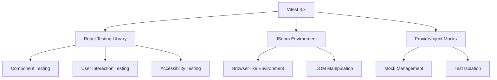

# Frontend Testing Guide

Comprehensive guide for testing React components, hooks, and frontend functionality in the Pulse web application using React Testing Library and Vitest 3.x.

## 🎯 Frontend Testing Stack



### **Core Technologies**

- **Vitest**: Modern testing framework with fast execution
- **React Testing Library**: Component testing focused on user behavior
- **JSdom**: Browser-like environment for DOM testing
- **@testing-library/jest-dom**: Additional DOM matchers
- **@testing-library/user-event**: Realistic user interaction simulation

## 🏗️ Test Setup Architecture

### **Modern Setup with Provide/Inject**

```typescript
// apps/web/src/test/setup.ts
import "@testing-library/jest-dom";
import { afterEach, beforeEach, vi, provide } from "vitest";
import { cleanup } from "@testing-library/react";
import React from "react";

// Mock function factories
const createMockUseQuery = () => vi.fn(() => null);
const createMockUseMutation = () => vi.fn(() => vi.fn());
const createMockUseAction = () => vi.fn(() => vi.fn());
const createMockUseAuthActions = () => vi.fn(() => ({
  signIn: vi.fn(),
  signOut: vi.fn(),
}));

// Setup test environment
beforeEach(() => {
  // Provide fresh mock instances for each test
  provide('mockUseQuery', createMockUseQuery());
  provide('mockUseMutation', createMockUseMutation());
  provide('mockUseAction', createMockUseAction());
  provide('mockUseAuthActions', createMockUseAuthActions());
});

// Cleanup after each test
afterEach(() => {
  cleanup();
  vi.clearAllMocks();
});
```

### **Comprehensive Mock Configuration**

```typescript
// Mock Convex with dynamic mock injection
vi.mock("convex/react", async () => {
  const { inject } = await import('vitest');
  return {
    useQuery: () => inject('mockUseQuery', () => vi.fn(() => null))(),
    useMutation: () => inject('mockUseMutation', () => vi.fn(() => vi.fn()))(),
    useAction: () => inject('mockUseAction', () => vi.fn(() => vi.fn()))(),
    Authenticated: vi.fn(({ children }: any) => children),
    Unauthenticated: vi.fn(({ children }: any) => children),
    ConvexReactClient: vi.fn(),
    ConvexProvider: vi.fn(({ children }: any) => children),
  };
});

// Mock Convex Auth with dynamic injection
vi.mock("@convex-dev/auth/react", async () => {
  const { inject } = await import('vitest');
  return {
    useAuthActions: () => inject('mockUseAuthActions', createMockUseAuthActions)(),
    ConvexAuthProvider: vi.fn(({ children }: any) => children),
  };
});

// Mock TanStack Router
vi.mock("@tanstack/react-router", () => ({
  useNavigate: vi.fn(() => vi.fn()),
  useLocation: vi.fn(() => ({ pathname: "/" })),
  useRouterState: vi.fn(() => ({ isLoading: false })),
  Link: vi.fn(({ children, to, ...props }: any) => 
    React.createElement("a", { href: to, ...props }, children)
  ),
  createFileRoute: vi.fn((path: string) => ({
    component: vi.fn(),
    useSearch: () => ({}),
  })),
  createRootRouteWithContext: vi.fn(() => ({})),
  Outlet: vi.fn(({ children }: any) => children || React.createElement("div")),
  HeadContent: vi.fn(() => null),
  TanStackRouterDevtools: vi.fn(() => null),
}));
```

## 🧪 Component Testing Patterns

### **Basic Component Testing**

```typescript
import { render, screen } from '@testing-library/react';
import { expect, test } from 'vitest';
import { Dashboard } from '../Dashboard';

test('renders dashboard with welcome message', () => {
  render(<Dashboard />);
  
  expect(screen.getByText('Welcome to Dashboard')).toBeInTheDocument();
  expect(screen.getByRole('main')).toBeInTheDocument();
});
```

### **Testing with Props**

```typescript
import { render, screen } from '@testing-library/react';
import { expect, test } from 'vitest';
import { UserProfile } from '../UserProfile';

test('displays user information correctly', () => {
  const user = {
    _id: 'user_123',
    name: 'John Doe',
    email: 'john@example.com',
    image: 'https://example.com/avatar.jpg'
  };
  
  render(<UserProfile user={user} />);
  
  expect(screen.getByText('John Doe')).toBeInTheDocument();
  expect(screen.getByText('john@example.com')).toBeInTheDocument();
  expect(screen.getByRole('img')).toHaveAttribute('src', user.image);
});

test('shows loading state when user is undefined', () => {
  render(<UserProfile user={undefined} />);
  
  expect(screen.getByText('Loading...')).toBeInTheDocument();
});
```

### **Testing User Interactions**

```typescript
import { render, screen, fireEvent } from '@testing-library/react';
import userEvent from '@testing-library/user-event';
import { expect, test, vi } from 'vitest';
import { SignInForm } from '../SignInForm';

test('calls onSubmit with form data when submitted', async () => {
  const user = userEvent.setup();
  const mockOnSubmit = vi.fn();
  
  render(<SignInForm onSubmit={mockOnSubmit} />);
  
  const emailInput = screen.getByLabelText(/email/i);
  const passwordInput = screen.getByLabelText(/password/i);
  const submitButton = screen.getByRole('button', { name: /sign in/i });
  
  await user.type(emailInput, 'test@example.com');
  await user.type(passwordInput, 'password123');
  await user.click(submitButton);
  
  expect(mockOnSubmit).toHaveBeenCalledWith({
    email: 'test@example.com',
    password: 'password123'
  });
});

test('displays validation error for invalid email', async () => {
  const user = userEvent.setup();
  
  render(<SignInForm onSubmit={vi.fn()} />);
  
  const emailInput = screen.getByLabelText(/email/i);
  const submitButton = screen.getByRole('button', { name: /sign in/i });
  
  await user.type(emailInput, 'invalid-email');
  await user.click(submitButton);
  
  expect(screen.getByText('Please enter a valid email')).toBeInTheDocument();
});
```

## 🔗 Testing with Convex Integration

### **Mocking Convex Hooks**

```typescript
import { render, screen } from '@testing-library/react';
import { expect, test, vi } from 'vitest';
import { WorkspaceList } from '../WorkspaceList';
import { getTestMocks } from '@/test/setup';

test('displays workspaces from Convex query', () => {
  const { mockUseQuery } = getTestMocks();
  
  const mockWorkspaces = [
    { _id: 'ws1', name: 'Personal', type: 'personal' },
    { _id: 'ws2', name: 'Team Project', type: 'shared' }
  ];
  
  mockUseQuery.mockReturnValue(mockWorkspaces);
  
  render(<WorkspaceList />);
  
  expect(screen.getByText('Personal')).toBeInTheDocument();
  expect(screen.getByText('Team Project')).toBeInTheDocument();
});

test('shows loading state while fetching workspaces', () => {
  const { mockUseQuery } = getTestMocks();
  
  mockUseQuery.mockReturnValue(undefined); // Convex loading state
  
  render(<WorkspaceList />);
  
  expect(screen.getByText('Loading workspaces...')).toBeInTheDocument();
});

test('handles mutation calls correctly', async () => {
  const { mockUseMutation } = getTestMocks();
  const mockCreateWorkspace = vi.fn();
  
  mockUseMutation.mockReturnValue(mockCreateWorkspace);
  
  const user = userEvent.setup();
  render(<CreateWorkspaceForm />);
  
  await user.type(screen.getByLabelText(/workspace name/i), 'New Project');
  await user.click(screen.getByRole('button', { name: /create/i }));
  
  expect(mockCreateWorkspace).toHaveBeenCalledWith({
    name: 'New Project'
  });
});
```

### **Testing Authentication States**

```typescript
import { render, screen } from '@testing-library/react';
import { expect, test, vi } from 'vitest';
import { Navigation } from '../Navigation';
import { getTestMocks } from '@/test/setup';

test('shows sign in button when user is not authenticated', () => {
  const { mockUseAuthActions } = getTestMocks();
  
  mockUseAuthActions.mockReturnValue({
    signIn: vi.fn(),
    signOut: vi.fn()
  });
  
  render(<Navigation isAuthenticated={false} />);
  
  expect(screen.getByRole('button', { name: /sign in/i })).toBeInTheDocument();
  expect(screen.queryByRole('button', { name: /sign out/i })).not.toBeInTheDocument();
});

test('shows user menu when authenticated', () => {
  render(<Navigation isAuthenticated={true} user={mockUser} />);
  
  expect(screen.getByText(mockUser.name)).toBeInTheDocument();
  expect(screen.getByRole('button', { name: /sign out/i })).toBeInTheDocument();
});
```

## 🎨 Testing UI Components

### **Testing Flowbite Components**

```typescript
import { render, screen } from '@testing-library/react';
import { expect, test } from 'vitest';
import { CustomCard } from '../CustomCard';

test('renders card with proper structure', () => {
  render(
    <CustomCard title="Test Title" description="Test description">
      <div>Card content</div>
    </CustomCard>
  );
  
  // Flowbite components are mocked, so we test the structure
  expect(screen.getByText('Test Title')).toBeInTheDocument();
  expect(screen.getByText('Test description')).toBeInTheDocument();
  expect(screen.getByText('Card content')).toBeInTheDocument();
});

test('applies custom styling correctly', () => {
  render(<CustomCard className="custom-class" />);
  
  const cardElement = screen.getByRole('article'); // Assuming card has role="article"
  expect(cardElement).toHaveClass('custom-class');
});
```

### **Testing Form Components**

```typescript
import { render, screen } from '@testing-library/react';
import userEvent from '@testing-library/user-event';
import { expect, test, vi } from 'vitest';
import { SettingsForm } from '../SettingsForm';

test('validates form fields before submission', async () => {
  const user = userEvent.setup();
  const mockOnSave = vi.fn();
  
  render(<SettingsForm onSave={mockOnSave} />);
  
  const submitButton = screen.getByRole('button', { name: /save/i });
  
  // Submit without filling required fields
  await user.click(submitButton);
  
  expect(screen.getByText('Name is required')).toBeInTheDocument();
  expect(mockOnSave).not.toHaveBeenCalled();
});

test('submits form with valid data', async () => {
  const user = userEvent.setup();
  const mockOnSave = vi.fn();
  
  render(<SettingsForm onSave={mockOnSave} />);
  
  await user.type(screen.getByLabelText(/name/i), 'John Doe');
  await user.type(screen.getByLabelText(/email/i), 'john@example.com');
  await user.click(screen.getByRole('button', { name: /save/i }));
  
  expect(mockOnSave).toHaveBeenCalledWith({
    name: 'John Doe',
    email: 'john@example.com'
  });
});
```

## 🗂️ Testing Routing Components

### **Testing TanStack Router Integration**

```typescript
import { render, screen } from '@testing-library/react';
import userEvent from '@testing-library/user-event';
import { expect, test, vi } from 'vitest';
import { WorkspaceNavigation } from '../WorkspaceNavigation';

// Mock useNavigate hook
const mockNavigate = vi.fn();
vi.mocked(require('@tanstack/react-router').useNavigate).mockReturnValue(mockNavigate);

test('navigates to workspace when clicked', async () => {
  const user = userEvent.setup();
  const workspace = { _id: 'ws1', name: 'Test Workspace', slug: 'test-workspace' };
  
  render(<WorkspaceNavigation workspace={workspace} />);
  
  const workspaceLink = screen.getByRole('link', { name: /test workspace/i });
  await user.click(workspaceLink);
  
  expect(mockNavigate).toHaveBeenCalledWith({
    to: '/w/$slug',
    params: { slug: 'test-workspace' }
  });
});

test('highlights active workspace', () => {
  vi.mocked(require('@tanstack/react-router').useLocation).mockReturnValue({
    pathname: '/w/test-workspace'
  });
  
  const workspace = { _id: 'ws1', name: 'Test Workspace', slug: 'test-workspace' };
  
  render(<WorkspaceNavigation workspace={workspace} />);
  
  const workspaceLink = screen.getByRole('link', { name: /test workspace/i });
  expect(workspaceLink).toHaveClass('active'); // Assuming active class
});
```

## 🎭 Custom Render Utilities

### **Test Wrapper with Providers**

```typescript
// apps/web/src/test/utils.tsx
import React from 'react';
import { render, RenderOptions } from '@testing-library/react';
import { ConvexProvider } from 'convex/react';
import { ConvexReactClient } from 'convex/react';

// Mock Convex client for testing
const mockConvexClient = new ConvexReactClient('https://test.convex.cloud');

const TestProviders: React.FC<{ children: React.ReactNode }> = ({ children }) => {
  return (
    <ConvexProvider client={mockConvexClient}>
      {children}
    </ConvexProvider>
  );
};

export const customRender = (
  ui: React.ReactElement,
  options?: Omit<RenderOptions, 'wrapper'>
) => render(ui, { wrapper: TestProviders, ...options });

// Re-export everything
export * from '@testing-library/react';
export { customRender as render };
```

### **Test Data Factories**

```typescript
// apps/web/src/test/factories.ts
import { Id } from 'convex/_generated/dataModel';

export const createMockUser = (overrides = {}) => ({
  _id: 'user_123' as Id<'users'>,
  name: 'Test User',
  email: 'test@example.com',
  image: 'https://example.com/avatar.jpg',
  emailVerified: Date.now(),
  createdAt: Date.now(),
  updatedAt: Date.now(),
  ...overrides
});

export const createMockWorkspace = (overrides = {}) => ({
  _id: 'ws_123' as Id<'workspaces'>,
  name: 'Test Workspace',
  slug: 'test-workspace',
  type: 'shared' as const,
  plan: 'free' as const,
  isPersonal: false,
  createdAt: Date.now(),
  updatedAt: Date.now(),
  ...overrides
});

// Usage in tests
test('renders user profile correctly', () => {
  const user = createMockUser({ name: 'John Doe' });
  render(<UserProfile user={user} />);
  expect(screen.getByText('John Doe')).toBeInTheDocument();
});
```

## ♿ Accessibility Testing

### **Testing Semantic HTML**

```typescript
import { render, screen } from '@testing-library/react';
import { expect, test } from 'vitest';
import { MainLayout } from '../MainLayout';

test('has proper semantic structure', () => {
  render(<MainLayout />);
  
  expect(screen.getByRole('main')).toBeInTheDocument();
  expect(screen.getByRole('navigation')).toBeInTheDocument();
  expect(screen.getByRole('banner')).toBeInTheDocument(); // header
  expect(screen.getByRole('contentinfo')).toBeInTheDocument(); // footer
});

test('form has proper labels', () => {
  render(<ContactForm />);
  
  expect(screen.getByLabelText('Name')).toBeInTheDocument();
  expect(screen.getByLabelText('Email')).toBeInTheDocument();
  expect(screen.getByLabelText('Message')).toBeInTheDocument();
});
```

### **Keyboard Navigation Testing**

```typescript
import { render, screen } from '@testing-library/react';
import userEvent from '@testing-library/user-event';
import { expect, test } from 'vitest';
import { Navigation } from '../Navigation';

test('supports keyboard navigation', async () => {
  const user = userEvent.setup();
  
  render(<Navigation />);
  
  const firstLink = screen.getAllByRole('link')[0];
  const secondLink = screen.getAllByRole('link')[1];
  
  // Tab through navigation
  await user.tab();
  expect(firstLink).toHaveFocus();
  
  await user.tab();
  expect(secondLink).toHaveFocus();
  
  // Enter activates link
  await user.keyboard('{Enter}');
  // Assert navigation occurred
});
```

## 📊 Performance Testing

### **Testing Loading States**

```typescript
import { render, screen, waitFor } from '@testing-library/react';
import { expect, test } from 'vitest';
import { DataTable } from '../DataTable';

test('shows loading spinner while fetching data', async () => {
  const { mockUseQuery } = getTestMocks();
  
  // Start with loading state
  mockUseQuery.mockReturnValue(undefined);
  
  render(<DataTable />);
  
  expect(screen.getByRole('progressbar')).toBeInTheDocument();
  
  // Simulate data loading
  mockUseQuery.mockReturnValue([{ id: 1, name: 'Item 1' }]);
  
  await waitFor(() => {
    expect(screen.queryByRole('progressbar')).not.toBeInTheDocument();
    expect(screen.getByText('Item 1')).toBeInTheDocument();
  });
});
```

### **Testing Error States**

```typescript
import { render, screen } from '@testing-library/react';
import { expect, test } from 'vitest';
import { UserDashboard } from '../UserDashboard';

test('displays error message when data fetch fails', () => {
  const { mockUseQuery } = getTestMocks();
  
  mockUseQuery.mockReturnValue({
    error: 'Failed to fetch user data'
  });
  
  render(<UserDashboard />);
  
  expect(screen.getByText('Failed to fetch user data')).toBeInTheDocument();
  expect(screen.getByRole('button', { name: /retry/i })).toBeInTheDocument();
});
```

## 🚀 Running Web Tests

### **Development Commands**

```bash
# Run web tests in watch mode
pnpm test --workspace=web --watch

# Run specific test file
pnpm test apps/web/src/components/__tests__/Dashboard.test.tsx

# Run tests with UI
pnpm test --workspace=web --ui

# Run tests with coverage
pnpm test --workspace=web --coverage
```

### **CI/CD Commands**

```bash
# Run all web tests once
pnpm test --workspace=web --run

# Generate coverage report
pnpm test --workspace=web --coverage --run

# Run tests with JUnit reporter for CI
pnpm test --workspace=web --reporter=junit --outputFile=test-results.xml
```

## 🔍 Debugging Tests

### **Debug Configuration**

```typescript
// Add to vitest.workspace.ts for debugging
export default defineWorkspace([
  {
    test: {
      name: 'web',
      // Enable debugging
      logHeapUsage: true,
      globals: true,
      environment: 'jsdom'
    }
  }
]);
```

### **Debugging Patterns**

```typescript
import { render, screen, debug } from '@testing-library/react';
import { test } from 'vitest';

test('debug component output', () => {
  render(<ComplexComponent />);
  
  // Debug current DOM state
  screen.debug();
  
  // Debug specific element
  const button = screen.getByRole('button');
  screen.debug(button);
  
  // Log queries to understand what's available
  console.log('Available roles:', screen.getAllByRole('button'));
});
```

## 📚 Related Documentation

- **[Best Practices](./best-practices)** - General testing guidelines
- **[Authentication Testing](./auth-testing)** - Testing auth flows
- **[Workspace Configuration](./workspace)** - Test environment setup