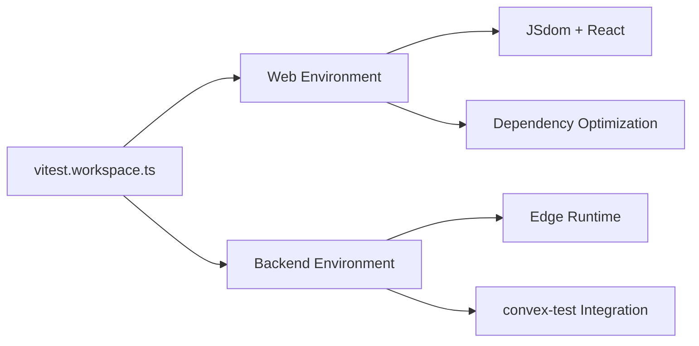

# Vitest Workspace Configuration

Pulse uses **Vitest 3.x workspace configuration** to provide unified testing across the monorepo with optimized performance and modern patterns.

## 🏗️ Architecture Overview

The workspace configuration replaces individual `vitest.config.ts` files with a single, centralized `vitest.workspace.ts` that manages multiple test environments.



## 📁 File Structure

```
pulse/
├── vitest.workspace.ts              # 🎯 Central workspace config
├── apps/
│   └── web/
│       ├── src/test/setup.ts        # Web test setup
│       └── vitest.config.ts         # ❌ Deprecated
└── packages/
    └── backend/
        ├── convex/test.setup.ts     # Backend test setup
        └── vitest.config.ts         # ❌ Deprecated
```

## ⚙️ Workspace Configuration

### **Complete Configuration**

```typescript
/**
 * Vitest Workspace Configuration
 * 
 * Modern monorepo test setup using Vitest 3.x workspace pattern.
 * Provides isolated test environments for web and backend packages
 * with optimized dependency handling and coverage reporting.
 */

import { defineWorkspace } from 'vitest/config';
import react from '@vitejs/plugin-react';
import path from 'node:path';

export default defineWorkspace([
  {
    plugins: [react()],
    test: {
      name: 'web',
      root: './apps/web',
      environment: 'jsdom',
      setupFiles: ['./src/test/setup.ts'],
      globals: true,
      css: true,
      clearMocks: true,
      restoreMocks: true,
      deps: {
        optimizer: {
          web: {
            include: [
              '@testing-library/react',
              '@testing-library/jest-dom', 
              'flowbite-react',
              '@tanstack/react-router'
            ]
          }
        }
      },
      coverage: {
        provider: 'v8',
        reporter: ['text', 'html'],
        exclude: [
          'node_modules/',
          'src/test/',
          '**/*.test.{ts,tsx}',
          '**/*.spec.{ts,tsx}'
        ]
      }
    },
    resolve: {
      alias: {
        '@': path.resolve(__dirname, './apps/web/src'),
      },
    },
    server: {
      deps: {
        inline: ['@convex-dev/auth', 'convex'],
      },
    }
  },
  {
    test: {
      name: 'backend',
      root: './packages/backend',
      environment: 'edge-runtime',
      setupFiles: ['./convex/test.setup.ts'],
      globals: true,
      passWithNoTests: true,
      maxConcurrency: 5,
      slowTestThreshold: 300,
      dangerouslyIgnoreUnhandledErrors: false,
      server: {
        deps: {
          inline: ['convex-test']
        }
      },
      coverage: {
        provider: 'v8',
        reporter: ['text', 'json', 'html'],
        include: ['convex/**/*.{js,ts}'],
        exclude: [
          'convex/_generated/**', 
          'convex/**/*.test.{js,ts}', 
          'convex/**/*.d.ts'
        ]
      }
    },
    resolve: {
      alias: {
        '@': path.resolve(__dirname, './packages/backend/convex'),
      },
    }
  }
]);
```

## 🎯 Key Features

### **1. Environment Isolation**

Each workspace gets its own optimized environment:

| Workspace | Environment | Purpose | Plugins |
|-----------|-------------|---------|---------|
| **web** | `jsdom` | React component testing | `@vitejs/plugin-react` |
| **backend** | `edge-runtime` | Convex function testing | None |

### **2. Dependency Optimization**

Smart caching and optimization for faster test execution:

```typescript
deps: {
  optimizer: {
    web: {
      include: [
        '@testing-library/react',
        '@testing-library/jest-dom', 
        'flowbite-react',
        '@tanstack/react-router'
      ]
    }
  }
}
```

**Benefits**:
- ⚡ **Faster startup**: Pre-optimized dependencies
- 🔄 **Better caching**: Intelligent dependency resolution
- 🎯 **Reduced overhead**: Only optimizes what's needed

### **3. Coverage Configuration**

Comprehensive coverage reporting with smart exclusions:

```typescript
coverage: {
  provider: 'v8',
  reporter: ['text', 'html', 'json'],
  exclude: [
    'node_modules/',
    'src/test/',
    '**/*.test.{ts,tsx}',
    '**/*.spec.{ts,tsx}'
  ]
}
```

### **4. Path Resolution**

Consistent alias resolution across workspaces:

```typescript
resolve: {
  alias: {
    '@': path.resolve(__dirname, './apps/web/src'),  // Web workspace
    '@': path.resolve(__dirname, './packages/backend/convex'),  // Backend workspace
  },
}
```

## 🚀 Performance Optimizations

### **Backend Concurrency Settings**

```typescript
test: {
  maxConcurrency: 5,              // Limit parallel tests
  slowTestThreshold: 300,         // Flag slow tests (300ms)
  dangerouslyIgnoreUnhandledErrors: false,  // Strict error handling
}
```

### **Server Dependencies**

Inline critical dependencies for better performance:

```typescript
server: {
  deps: {
    inline: ['@convex-dev/auth', 'convex'],    // Web workspace
    inline: ['convex-test']                     // Backend workspace
  },
}
```

## 📊 Usage Patterns

### **Run All Workspaces**

```bash
# Run tests in all workspaces
pnpm test

# Run with coverage
pnpm test --coverage

# Run in watch mode
pnpm test --watch
```

### **Run Specific Workspace**

```bash
# Run only web tests
pnpm test --workspace=web

# Run only backend tests  
pnpm test --workspace=backend

# Run specific test file
pnpm test apps/web/src/components/__tests__/dashboard.test.tsx
```

### **Development Workflow**

```bash
# Start web test watcher
pnpm test --workspace=web --watch

# Run backend tests once
pnpm test --workspace=backend --run

# Generate coverage for specific workspace
pnpm test --workspace=web --coverage
```

## 🔧 Advanced Configuration

### **Custom Test Matchers**

Both workspaces inherit global test configuration:

```typescript
test: {
  globals: true,              // Global test functions (describe, it, expect)
  clearMocks: true,           // Clear mocks between tests  
  restoreMocks: true,         // Restore original implementations
}
```

### **Environment-Specific Setup**

Each workspace can have its own setup files:

- **Web**: `apps/web/src/test/setup.ts` - React Testing Library + mocks
- **Backend**: `packages/backend/convex/test.setup.ts` - convex-test + modules

### **Reporter Configuration**

Flexible output formats for different use cases:

```typescript
coverage: {
  reporter: [
    'text',     // Console output
    'html',     // Interactive HTML reports
    'json'      // Machine-readable data
  ]
}
```

## 🚨 Migration from Individual Configs

### **Before (Individual Configs)**

```typescript
// apps/web/vitest.config.ts
export default defineConfig({
  plugins: [react()],
  test: {
    environment: 'jsdom',
    setupFiles: ['./src/test/setup.ts'],
  }
});

// packages/backend/vitest.config.ts  
export default defineConfig({
  test: {
    environment: 'edge-runtime',
    setupFiles: ['./convex/test.setup.ts'],
  }
});
```

### **After (Workspace Config)**

```typescript
// vitest.workspace.ts (single file)
export default defineWorkspace([
  { /* web config */ },
  { /* backend config */ }
]);
```

**Benefits of Migration**:
- ✅ **Single source of truth**: One configuration file
- ✅ **Better performance**: Shared optimization across workspaces
- ✅ **Easier maintenance**: Unified configuration updates
- ✅ **Modern patterns**: Latest Vitest 3.x features

## 🎨 Best Practices

### **Workspace Naming**

Use descriptive names for easy identification:

```typescript
test: {
  name: 'web',        // Frontend tests
  name: 'backend',    // Backend tests  
  name: 'e2e',        // End-to-end tests (future)
}
```

### **Root Path Management**

Set appropriate root paths for each workspace:

```typescript
test: {
  root: './apps/web',           // Web application root
  root: './packages/backend',   // Backend package root
}
```

### **Selective Test Execution**

Use workspace names for targeted testing:

```bash
# Development - fast feedback
pnpm test --workspace=web --watch

# CI/CD - comprehensive validation  
pnpm test --run --coverage
```

## 🔗 Related Documentation

- **[Web Testing](./web-testing)** - Frontend testing patterns using this workspace
- **[Backend Testing](./backend-testing)** - Backend testing with edge runtime
- **[Best Practices](./best-practices)** - Testing guidelines and patterns